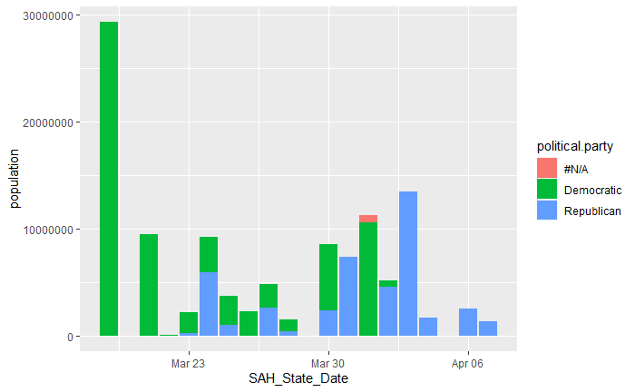
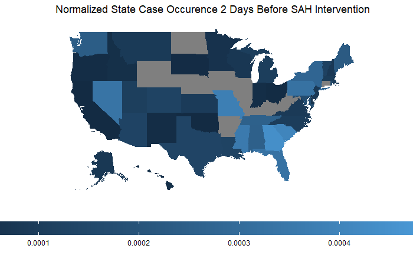
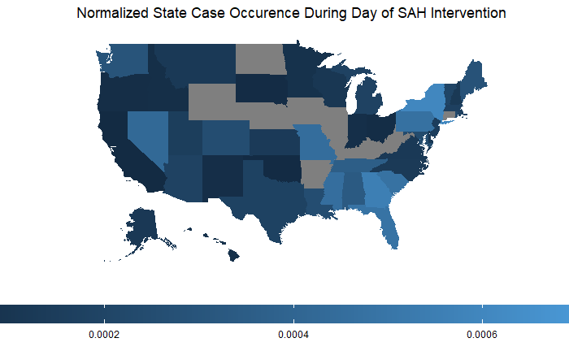

```{r setup, include=FALSE}
knitr::opts_chunk$set(echo = TRUE)
```

# Introduction
As COVID-19 became a pandemic in the United States, both counties and states began implementing their own measures to slow the spread of the virus. The springboard for this project was the COVID-19 Spatial Response project led by the University of Arizona. Our team was tasked with the objective to contribute to the project by aggregating intervention data to reveal how COVID-19 interventions, specifically Stay at Home orders (SAH), were contributing to the flattening of the curve of infections across the United States.

This objective, along with other COVID-19 related data science projects are widespread, but a robust, verified, and highly cited dataset is less ubiquitous. Data was gathered from a variety of sources including Google, The New York Times, other crowdsourced intervention databases, and various local news agencies. The information that lies in the data is validated through these sources and is provided in a publicly accessible table through Google. Analysis was undertaken to highlight changes and trends in county mobility, cases, and SAH interventions. Visualization is provided through plots, and graphs to better understand the trends of the data under various conditions (date, cases, political party, and population). Built off of R , this project provides a diverse set of analysis, datasets, and visualization techniques.

# Methods
The goals of this project are two-tiered:\

1. Data Collection
2. Data Analysis

## Phase 1
For the first phase, we sought to contribute accurate county-level stay-at-home intervention data to University of Arizona’s COVID-19 Spatial Intervention Database. Though the UA team is collecting a variety of intervention types, we decided to focus on stay-at-home measures to reduce the workload to something more manageable within the given timeframe. The [New York Times](https://www.nytimes.com/interactive/2020/us/states-reopen-map-coronavirus.html) published an article outlining all the states’ stay-at-home order dates . This data was web scraped and packaged as an .rda file for analysis using the rvest library. 

### Mobility & The Change Detection Analysis
Certain counties implemented stay-at-home measures prior to the state. In order to identify these exceptions, we leveraged Google’s released [mobility data](https://www.google.com/covid19/mobility/) to flag the counties that experienced a drop in mobility beyond baseline prior to the state stay-at-home order. To do this we acquired mobility data between February 15 and April 9th. Although the data contained movement information for grocery stores, pharmacies, parks and residential mobility, our analysis focused solely on change in workplace population. To determine counties with some indication of a county-level intervention, we determine a changepoint in the analysis where a significant change in workplace trend is seen before a state-level stay-at-home intervention. We then calculate the mean change in movement before and after this changepoint. During the validation, the counties with the highest mean drop post changepoint were prioritized. In total, we manually validated 269 counties. This table is packaged as an .rda file called county_interventions in the covid19interventions package.

## Phase 2
For the second phase, we analyzed our county-level SAH data as well as the scraped NYT data for a complete state-level overview.

### Interventions & Cases
The first step of the new phase was to create a database that housed the amount of cases per state before, during, and after the state SAH was implemented by normalizing by population to get the rate of infection. Visualizations in the form of maps were created and normalized by population.

### Visualizing Stay at home orders and policy shift among states
Next, visualizations were created to reveal the relationships between population, date, and political party. This required a join between multiple datasets between various sources. Additionally, the data were standardized to remove blank values and then displayed using ggplot.

```{r, fig.align='center', out.width = "600px", echo=FALSE}

```

```{r, fig.align='center', out.width = "600px", echo=FALSE}
knitr::include_graphics("output/0000b4.PNG")
```

### Flattening the Curve
For our final study, we investigated whether SAH orders indeed “flattened” the curve.

- First we assume the rise in cases follows the exponential function:
<center> y = A$e^{kt}$ &rarr; ln(y) = kt + ln(A) </center>
<center> y = cases </center>
<center> A = initial value </center>
<center> k = rate of growth </center>
<center> t (or x) = time </center>
\
```{r, fig.align='center', out.width = "600px", echo=FALSE}
knitr::include_graphics("output/example5.PNG")
```

- Next, we “linearized” the exponential rise of cases with natural log. This graph plots the natural log of cases on the y-axis by time on the x-axis. The slope of this “line” is therefore k, the rate of cases growth. The natural log curve was smoothed before calculating slope values between each pair of points.

<center> ln(y) = kt + ln(A) </center>
\
```{r, fig.align='center', out.width = "600px", echo=FALSE}
knitr::include_graphics("output/example6.PNG")
```

- The next step was to locate breakpoints in the k plot using the package `segmented` with help from the `breakpoints()` function in the `strucchange` package by Achim Zeileis to estimate input parameters. This stage identifies dates of significant slope change, depicted in grey.

```{r, fig.align='center', out.width = "600px", echo=FALSE}
knitr::include_graphics("output/example7.PNG")
```

- We assume the latest (last) breakpoint is the day in which the rate of COVID-19 cases begins to slow, i.e. when the curve flattens, as shown in red. Lastly, the difference between the SAH order date, shown in blue, and the flatten breakpoint was calculated to find the “lag,” the time it took for the SAH order to take effect. In Alaska’s case, the lag was 16 days.

```{r, fig.align='center', out.width = "600px", echo=FALSE}
knitr::include_graphics("output/example8.PNG")
```

- This analysis was conducted both at the state level, using the NYT scraped data, and at the county level, using our county_intervention database.

```{r, fig.align='center', out.width = "600px", echo=FALSE}
knitr::include_graphics("output/example4.PNG")
```

# Results
## Mobility & The Change Detection Analysis
The mobility trends varied by county, however, there is an overall decline in mobility for all counties. This analysis focused on workplace mobility due to the smallest amount of missing data. We used an approximation method to interpolate any missing data. A higher decline is observed in counties that enacted a stay-at-home order or had a spike in the number of cases. For example, in the plot below, the changepoint for Los Angeles County, CA, is identified on March 16th. Before March 16th, there was a 0.43% drop in the workplace population. A 28% drop was seen between March 17th and March 19th when the state of California enforced a stay at home order. In comparison, San Francisco’s changepoint is observed on March 17th. Before this day, the mean workplace population was -6.97%, and between March 17th and March 19th, there is a -66% drop.

```{r, fig.align='center', out.width = "400px", echo=FALSE}
knitr::include_graphics(c("output/la_changepoint.PNG", "output/sf_changepoint.PNG"))
```
<center>
_Changepoint for Los Angeles County, CA (Top) & San Francisco County, CA (Bottom)_
</center>

## Interventions & Cases
The Stay at Home Interventions at a state level revealed that the magnitude of new cases per population of state began to show a flattening effect of the curve for some areas over time. This was especially the case for more rural areas in comparison with densely populated areas, which take a longer period (2-4 weeks) to begin to show a trend in consistent flattening.

```{r, fig.align='center', out.width = "600px", echo=FALSE}

```

```{r, fig.align='center', out.width = "600px", echo=FALSE}

```

```{r, fig.align='center', out.width = "600px", echo=FALSE}
knitr::include_graphics("output/state_1w_after.PNG")
```

```{r, fig.align='center', out.width = "600px", echo=FALSE}
knitr::include_graphics("output/state_2w_after.PNG")
```

```{r, fig.align='center', out.width = "600px", echo=FALSE}
knitr::include_graphics("output/state_4w_after.PNG")
```

## Visualizing Stay at home orders and policy shift among states
States and policy shifts can be ambiguous unless visualized. When chartered and graphed after a standardization and clean up process, a clear dominance of SAH orders emerge across both political countries and geographically across the country. When plotting in time Republican governors enacting statewide SAH started in  March and early April (at large scale)  when compared to Democrats mid March to late March large scale enactment.

## Flattening the Curve
Currently, we have yet to conduct quantitative analyses on the lags, but a general overview of the values reveals that, at the state level, the flattening breakpoint tends to occur within two weeks after the SAH order. It is important to note that there are states with negative lags. These cases typically presumably have no flattening breakpoint just yet. The R script must therefore be amended to only select flattening breakpoints that occur after the SAH order date.

```{r, fig.align='center', out.width = "600px", echo=FALSE}
knitr::include_graphics("output/state_Mississippi.PNG")
```

At the county level, lag values are greater which suggests that county-level interventions are not as successful as state SAH mandates. Overall, a wide range of dates is to be expected given not all residents strictly abided to the SAH order. Future work would pair the lag data with the Google mobility data and/or [Unacast’s Social Distancing Scoreboard](https://www.unacast.com/covid19/social-distancing-scoreboard), which grades each county based on their mobility.

# Discussion
Overall each analysis led to the same notion that SAH interventions were impactful in flattening the curve of infections in the United States. This was especially apparent when the earliest SAH interventions were sanctioned in mid-March. The focal point is that the earlier interventions were implemented by counties and areas that were experiencing high infection rates. After widespread SAH orders, US citizens' routines changed drastically. This change is reflected in the analysis on mobility and in a recent paper, “Do Stay-at-Home Orders Cause People to Stay at Home? Effects of Stay-at-Home Orders on Consumer Behavior” (Alexander 2020). This paper found that after a SAH order was implemented, a decrease in Google’s county level mobility data followed (Alexander 2020).

The limitation in data prior to the intervention restricts the analysis from seeing the full effect of the SAH intervention. However, data continues to pour in as the epidemic rages on. With post intervention data, it is possible to keep assessing how cases were accumulating from there onwards to find where the exact point of the curve began and ended. Additionally, more interventions and deaths would be incorporated and measured with future work to see how they affect the curve.

In the flattening of the curve analysis, there is no reference point for what the epidemic curve would look like if intervention measures were not put into place. Therefore, to analyze whether the SAH measures impacted the curve, our analysis assumed an exponential rise of cases, when in reality epidemic curves are normally distributed. The decrease in slope could be the plateau of the epidemic curve running its natural course. Perhaps a more accurate analysis would incorporate a naturally distributed epidemic curve, modeled by experts in this field based on the initial rise in coronavirus cases.

There are many opportunities for future work in our analysis. Firstly, it is important to conduct quantitative analyses on the lag values before drawing any conclusions about whether the SAH order date impacted the curve. Furthermore, there are a variety of intervention measures put in place prior to the most extreme SAH orders that may have had a significant impact on the rate of cases growth; this is not to mention more elusive factors, such as motivation by fear. In addition, as mentioned previously, we would like to pair lag data with mobility data, either from Google or Unacast. Ultimately, more analyses can be mined from our data. We have yet, for example, to compare states who did and did not impose a SAH order, nor did we fully compare the differences between the county-level and state-level interventions. We would also like to introduce and investigate the relationship between SAH intervention dates and additional variables, such as rurality or contiguity to affected counties. Lastly, we are poised at an interesting point in time wherein state and local governments are beginning to relax and/or lift intervention measures. It would be interesting to analyze these future behaviors. For example, we could identify which political parties lifted intervention orders earlier to bolster our current analysis. Clearly, the COVID-19 intervention database is fertile for future analyses.

# References
Alexander, Diane and Karger, Ezra, Do Stay-at-Home Orders Cause People to Stay at Home? Effects of Stay-at-Home Orders on Consumer Behavior (April 18, 2020). FRB of Chicago Working Paper No. WP-2020-12. Available at [SSRN](https://ssrn.com/abstract=3583625) or [HTTP](http://dx.doi.org/10.2139/ssrn.3583625)

<center>
[Back to top](#introduction)
</center>


