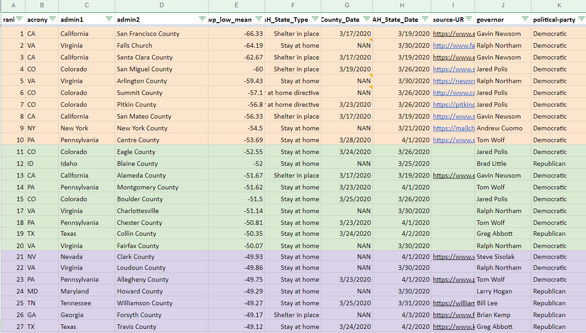
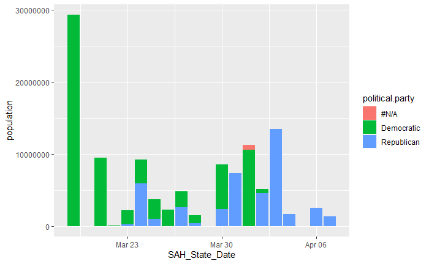
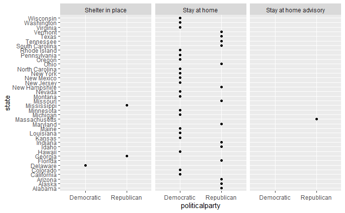
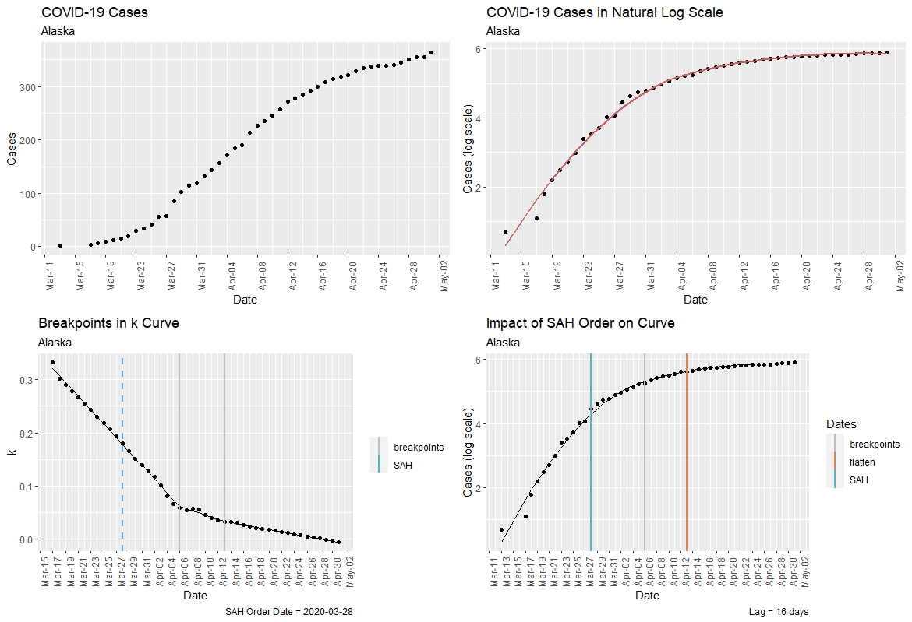
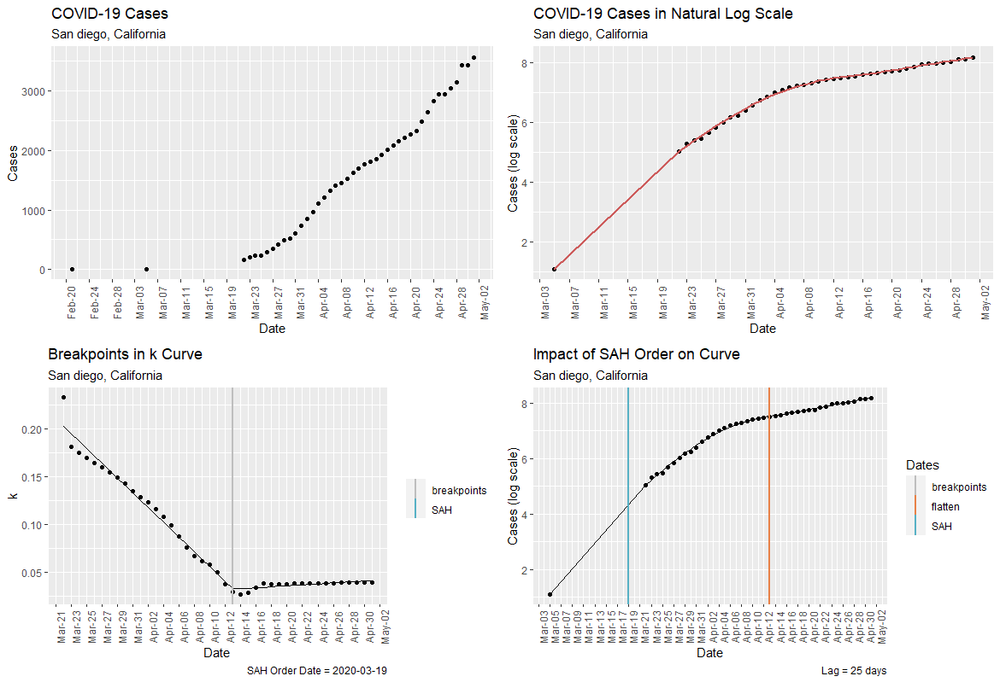

```{r setup, include=FALSE}
knitr::opts_chunk$set(echo = FALSE)
library(covid19interventions)
library(shiny)
library(DT)
library(ggplot2)
library(tidyverse)
library(changepoint)
library(shinythemes)
library(DT)
library(knitr)

data(mobility)
data(county_intervention_cases)

data(county_interventions)
data(df_joined)
```

## Overview
- COVID-19 is an infectious and easily communicable virus
- The U.S. confirmed its first case of COVID-19 on _Jan. 21, 2020_
- On _Feb. 26, 2020_, the first suspected case of a community spread in the U.S. reported
- Local government bodies were first to enforce stay-at-home orders to prevent the spread of COVID-19 before statewide measures implemented


## Goal
- Identify counties that enforced stay-at-home measures before their state to address the COVID-19 pandemic 
- Understand if the county and state level intervention to minimize direct human contact affects the curve

## Methodology
- Initially collected data for all types of county-level interventions
- Focused on the two least and most populated counties in every state
- The process was slow- most counties did not have any interventions in place
- In the interest of time, limited interventions to stay-at-home orders only
- Google's Mobility dataset utilized to expedite the collection process by observing the change in movement at the county level

## Change in Mobility
- Movement information released by Google to support data-driven decision making in managing COVID-19
- Collected through Google products such as Google Maps
- Data reports percent change in movement across places in comparison to the median trend seen between _Jan. 3, 2020_ and _Feb. 5, 2020_
- Used to identify counties with the highest drop in workplace visits, potentially as a result of a county-level stay-at-home order

## Changepoint Analysis
- Changepoint detection technique used to determine the change in workplace mobility curve before a statewide stay-at-home was order implemented
- Specifically, At-Most-One-Change (AMOC) method used to identify a single point of significant change 
- Mean of workplace mobility calculated pre and post changepoint for every county
- Counties with the lowest mean for workplace visits post changepoint prioritized in the data collection process

## Change in Mobility by County
```{r, echo = FALSE}
fluidPage(
    sidebarLayout(
          sidebarPanel(
            htmlOutput("state_selector"),
            htmlOutput("county_selector"), width = "5"),
           mainPanel(plotOutput("cpplot"),
                     textOutput("pre_cp"),
                     textOutput("post_cp"),
                     width = 7)))
        

output$state_selector <- renderUI({
selectInput(
  inputId = "state", 
  label = "State:",
  choices = as.character(unique(df_joined$sub_region_1)),
  selected = "California")
  })

output$county_selector <- renderUI({
  available <- df_joined[df_joined$sub_region_1 == input$state, "sub_region_2"]
  selectInput(
    inputId = "county", 
    label = "County:",
    choices = unique(available),
    selected = "Los Angeles County")
})
  
  output$cpplot <- renderPlot({
    cp_calc <- df_joined %>% filter(sub_region_1 == input$state & 
                               sub_region_2 == input$county &
                               date < order_date &
                               !is.na(workplace_int)) %>%
    select(workplace_int) %>% 
    as.matrix() %>% 
    as.numeric() %>% 
    cpt.mean(method='AMOC')
    plot(cp_calc, cpt.col='blue', 
       ylab = "Workplace Mobility Change from Baseline (%)",
       xlab = "Days since February 15")
    output$pre_cp <- renderText({paste("Pre Changepoint Mean: ",
                                       round(param.est(cp_calc)$mean[1], 2))})
    output$post_cp <- renderText({paste("Post Changepoint Mean:",
                                        round(param.est(cp_calc)$mean[2]))})
    
})
```


## Final Interventions Database
```{r, fig.align='center'}

```

## Interventions
```{r}
county_interventions_cases_sl <- county_intervention_cases %>% 
  select(admin1, SAH_State_Date,cases, cases_2day_before, cases_week_after, cases_2week_after, cases_4week_after) %>% 
  distinct(admin1, SAH_State_Date,cases, cases_2day_before, cases_week_after, cases_2week_after, cases_4week_after)

#as.data.frame(county_interventions_cases_sl)                      
datatable(county_interventions_cases_sl)
```

## Before Interventions
```{r, fig.align='center', out.width = "600px"}
knitr::include_graphics("output/state_before_plot.PNG")
```

## During Interventions
```{r, fig.align='center', out.width = "600px"}
knitr::include_graphics("output/state_during_plot.PNG")
```

## 1 Week After Interventions
```{r, fig.align='center', out.width = "600px"}
knitr::include_graphics("output/state_1w_after.PNG")
```

## 2 Weeks After Interventions
```{r, fig.align='center', out.width = "600px"}
knitr::include_graphics("output/state_2w_after.PNG")
```

## 4 Weeks After Interventions
```{r, fig.align='center', out.width = "600px"}
knitr::include_graphics("output/state_4w_after.PNG")
```

## Rationale 
- Population density is one of the biggest factors in a pandemic
- Policy for COVID-19 has been decided on by governors in particular
- Expressing a Governor's political party will build overall trends in decision making for the US as a whole 
- Intervention types across the US were very different from Stay at home minors, to shelter in place
- Interventions also occurred across both March of 2020 and April 2020
  
## Population vs Intervention Date
- This chart shows the intervention date with the total population of the state. N/A for the party is for territory without a governor
- There is a clear difference in the political party's by the state for the state's intervention date
- Democrats tend to be earlier by the republicans were later in March and early April.

```{r, out.width = "600px", fig.align='center'}

```

## Political Party vs State Intervention Date
- Overall it shows the bipartisan policy between states for a stay at home order
- The chart shows the clear dominance geographically of the stay at home order
- Note this table leaves off 9 states that have no SAH order (of any type)


```{r, out.width = "600px", fig.align='center'}

```


## Flattening the Curve
- Did SAH interventions impact the curve?

- Methodology
  1. "Linearize" exponential rise of cases using natural log\
  \
  <center> y = A$e^{kt}$ &rarr; ln(y) = kt + ln(A) </center>
  \
  2. Smooth natural log scale graph
  3. Calculate slope k between all the datepoints
  4. Locate breakpoints in k curve to find dates of greates slope change
  5. Calculate the "lag" between the SAH order date and the last breakpoint

## Alaksa State

```{r, out.width = "700px", fig.align='center'}

```

## San Diego County, California

```{r, out.width = "700px", fig.align='center'}

```

## Future Work
- Investigate impact of different intervention measures
- Relate political party to date of SAH intervention
- Consider additional variables, such as rurality
- Quantitative analysis on lag dates
- Pair lag data with mobility data (Google + Unacast Scoreboard)
- Interesting opportunities for analysis as intervention measures are uplifted

## Thank you
- University of Arizona
- Lyndon
- Lei
