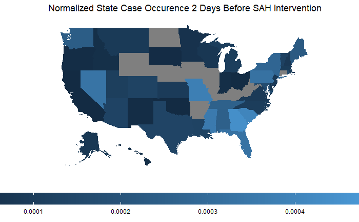
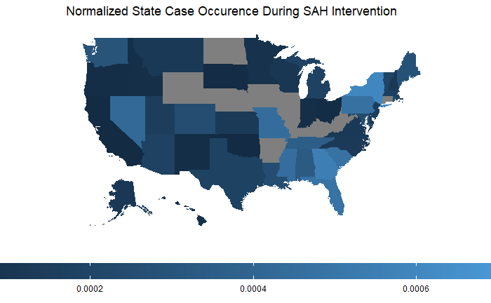

```{r setup, include=FALSE}
knitr::opts_chunk$set(echo = FALSE)
library(covid19interventions)
library(shiny)
library(DT)
library(ggplot2)
library(tidyverse)
library(changepoint)
library(shinythemes)
library(DT)

<<<<<<< HEAD
data(mobility)
data(county_intervention_cases)
=======
data(county_interventions)
data(df_joined)
>>>>>>> master
```

## Overview
- The U.S. confirmed its first case of COVID-19 on _Jan. 21, 2020_
- On _Feb. 26, 2020_, the first suspected case of a community spread in the U.S. reported
- Local government bodies were first to enforce stay-at-home orders to prevent the spread of COVID-19 before statewide measures implemented

## Goal
- Identify counties that enforced stay-at-home measures before their state to address the COVID-19 pandemic 
- Understand if the county-level intervention to minimize direct human contact affects the curve

## Methodology
- Initially collected data for all types of county-level interventions
- Focused on the two least and most populated counties in every state
- The process was slow- most counties did not have any interventions in place
- In the interest of time, limited interventions to stay-at-home orders only
- Google's Mobility dataset utilized to expedite the collection process by observing the change in movement at the county level

## Change in Mobility
- Movement information released by Google to support data-driven decision making in managing COVID-19
- Collected through Google products such as Google Maps
- Data reports percent change in movement across places in comparison to the median trend seen between _Jan. 3, 2020_ and _Feb. 5, 2020_
- Used to identify counties with the highest drop in workplace visits, potentially as a result of a county-level stay-at-home order

## Changepoint Analysis
- Changepoint detection technique used to determine the change in workplace mobility curve before a statewide stay-at-home was order implemented
- Specifically, At-Most-One-Change (AMOC) method used to identify a single point of significant change 
- Mean of workplace mobility calculated pre and post changepoint for every county
- Counties with the lowest mean for workplace visits post changepoint prioritized in the data collection process

## Change in Mobility by County
```{r, echo = FALSE}
fluidPage(
    sidebarLayout(
          sidebarPanel(
            htmlOutput("state_selector"),
            htmlOutput("county_selector"), width = "5"),
           mainPanel(plotOutput("cpplot"),
                     textOutput("pre_cp"),
                     textOutput("post_cp"),
                     width = 7)))
        

output$state_selector <- renderUI({
selectInput(
  inputId = "state", 
  label = "State:",
  choices = as.character(unique(df_joined$sub_region_1)),
  selected = "Alabama")
  })

output$county_selector <- renderUI({
  available <- df_joined[df_joined$sub_region_1 == input$state, "sub_region_2"]
  selectInput(
    inputId = "county", 
    label = "County:",
    choices = unique(available),
    selected = unique(available)[1])
})


  
  output$cpplot <- renderPlot({
    cp_calc <- df_joined %>% filter(sub_region_1 == input$state & 
                               sub_region_2 == input$county &
                               date < order_date &
                               !is.na(workplace_int)) %>%
    select(workplace_int) %>% 
    as.matrix() %>% 
    as.numeric() %>% 
    cpt.mean(method='AMOC')
    plot(cp_calc, cpt.col='blue', 
       ylab = "Workplace Mobility Change from Baseline (%)",
       xlab = "Days since February 15")
    output$pre_cp <- renderText({paste("Pre Changepoint Mean: ",
                                       round(param.est(cp_calc)$mean[1], 2))})
    output$post_cp <- renderText({paste("Post Changepoint Mean:",
                                        round(param.est(cp_calc)$mean[2]))})
    
})
```


## Interventions & COVID-19 Cases Curve
<<<<<<< HEAD
- Database Creation: Collecting County & State SAH Intervention Data for U.S
- Data Table
```{r}
=======
```{r}
datatable(county_interventions)
```

## Before & During Interventions
>>>>>>> master

county_interventions_cases_sl <- county_intervention_cases %>% select(admin1, SAH_State_Date,cases, cases_2day_before, cases_week_after, cases_2week_after, cases_4week_after) %>% distinct(admin1, SAH_State_Date,cases, cases_2day_before, cases_week_after, cases_2week_after, cases_4week_after)

#as.data.frame(county_interventions_cases_sl)                      
datatable(county_interventions_cases_sl)

```


## Before Interventions


## During Interventions


## 1 Week After Interventions


## 2 Weeks After Interventions


## 4 Weeks After Interventions


## Rationale- NOAH 
- Why we collected the attributes we did?
- Variety of variables that could have influenced a later SAH order

## Pop vs Intervention Date- NOAH

## Political Party vs State Intervention Date- NOAH

## Flattening the Curve

## Future Work


